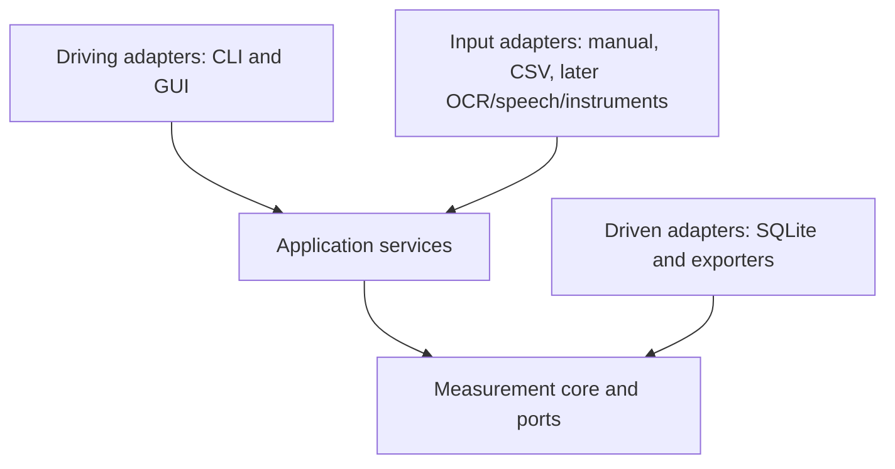

# Architecture

Status: M0 Revision Round 2 baseline. Runtime modules beyond the package shell
belong to their owning milestones and do not yet exist.

## Hexagonal dependency rule

Arrows below mean **source-code dependency/import direction**. Every dependency
points inward. Runtime control may call an injected adapter through a port in the
opposite direction, but the core never imports that adapter.



The measurement core MUST NOT import:

- GUI or CLI;
- SQLite or any persistence adapter;
- CSV/file input adapters;
- JSON/CSV/MAT/HDF5/NetCDF exporters;
- OCR, speech, or instrument adapters;
- cloud services.

Application services depend on core types and ports. Driving adapters invoke
application use cases. Driven adapters implement core/application ports and are
injected at the composition root. Optional adapters never become core
dependencies.

## Planned package layout

```text
src/smr/
├── core/                    M1 models, invariants, validation and ports
│   ├── measurement.py
│   ├── series.py
│   ├── observation.py
│   ├── provenance.py
│   └── validation.py
├── quantities/              M1 quantity registry and conversion policies
├── resources/               packaged runtime schemas/definitions when needed
├── application/             use cases and port orchestration
├── statistics/              M3 descriptive statistics/uncertainty boundary
├── adapters/
│   ├── persistence/         M2 SQLite implementation
│   ├── importers/           M2 CSV; later OCR/speech/instruments
│   └── exporters/           M2 JSON/CSV/Python/MAT; later HDF5/NetCDF
├── cli.py                   Typer driving adapter
└── gui/                     M4 optional PySide6 driving adapter
```

Folders are created when their milestone begins; empty speculative application
modules are avoided.

## Confirmation boundary

Manual and imported input first becomes a draft/candidate. An explicit user
confirmation targets a scalar or series candidate revision. Application services
then construct a confirmed record and request deterministic normalization and
validation from the core. CSV/array mappings support one batch confirmation;
raw input and mapping provenance remain intact.

## Storage boundary

SQLite is the authoritative v0.1 SMR record store, not a substitute for external
raw evidence. Repository interfaces isolate domain code from SQL. Stable
identity/state fields are relational; validated, versioned JSON may hold evolving
metadata. Transactions preserve aggregate consistency.

Migrations are forward-only and versioned. Before a migration that can rewrite
or remove stored structure, SMR creates/verifies a recoverable backup or refuses
the operation. Recovery restores the last known-good backup and retained raw
source references/digests. Reliable recovery is required; reversible/down
migrations are not promised.

## Provenance and export boundary

Scientific provenance describes capture, parse, confirm, normalize, derive, and
supersede operations. Export adapters create separate export manifests/activity
records referencing immutable input IDs/digests and output digests. Exporting
does not mutate a measurement or its scientific provenance.

## Series representation

The authoritative conceptual shape follows xarray: named coordinates, named data
variables, and explicit dimensions. A coordinate is either physical (with a
quantity definition) or an index (for example repeat number). NumPy and pandas
are projections; CSV may require a metadata sidecar. No conversion claims
losslessness when the target cannot represent all metadata or provenance.

## Resource packaging

Top-level `schemas/` contains repository contracts and M0 validation assets. Any
schema or quantity definition required by runtime code must be included inside
the installed `smr` distribution and loaded via a supported package-resource API.
Runtime code must work from an isolated wheel and must not assume the repository
checkout exists.

## Dependency policy

- Core runtime: NumPy, pandas, xarray, Pint, Pydantic, SciPy, and Typer.
- SQLite uses Python's standard library.
- PySide6 remains the optional `gui` extra and is excluded from M0/M1 quality
  jobs. M4 will add a dedicated GUI install/test job.
- `jsonschema` is development-only in M0 to validate the real JSON Schema and
  versioned quantity seed.
- PaddleOCR and faster-whisper are not v0.1 dependencies.
- New dependencies require a concrete need, license/maintenance assessment, and
  a decision record when architecturally material.

## Versioning

- `src/smr/_version.py` is the single package-version source.
- Stored records carry an SMR schema version.
- Quantity definitions and conversion policies are versioned.
- Breaking scientific/schema changes require a migration plan, decision record,
  and compatibility tests.
